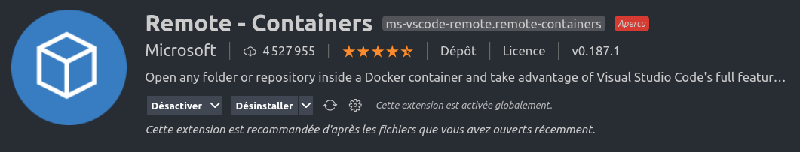
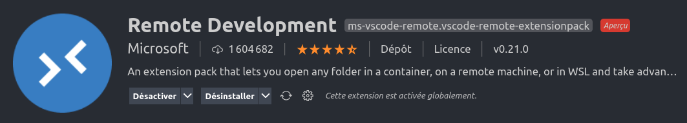
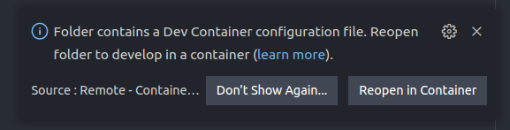

# This is a template for documentations with mkdocs

<p align="center">
  <a href="https://iotcluster.fr/"></a>
</p>

This repository will serve as a template for how to write technical documentations with the help of :

+ [MkDocs material](https://squidfunk.github.io/mkdocs-material/) for global architecture,
+ [mkdocstrings](https://mkdocstrings.github.io/) for Python docstrings implementation in MkDocs,
+ [MkDocs macros](https://mkdocs-macros-plugin.readthedocs.io/en/latest/) to allow macros and variables usage in MkDocs,
+ [diagrams](https://diagrams.mingrammer.com/) (Optional) to draw technical diagrams.

## How to Use MkDocs material

+ **Official documentation** : https://squidfunk.github.io/mkdocs-material/
+ **Calmcode tutorial** : https://calmcode.io/mkdocs/intro-to-mkdocs.html
+ **Using MkDocs for technical reporting** : https://www.timvink.nl/mkdocs-for-tech-doc/

Material for MkDocs is a theme for MkDocs, a static site generator geared towards (technical) project documentation. If you're familiar with Python, you can install Material for MkDocs with pip, the Python package manager.

```bash
pip install mkdocs-material
```
**A Dockerfile and a devcontainer vscode configuration file have been provided to avoid manual installation, see below for the instructions.**

### Architecture of a Material for MkDocs project

A Material for MkDocs project is composed of two parts :

1. A folder named `docs`, **be aware that this name can't be changed for mkdocs to work**, which contains the different parts of the documentation you'll, organized in subfolders and markdown `.md` files.
2. A `mkdocs.yml` file, used to configure :
    - the site name,
    - the author,
    - the address of deployment in development stage,
    - the various plugins and extensions,
    - how to navigate between the differents pages generated from the `.md` files located in the `docs` folder.

The navigation is configured in the `nav` section of the `mkdocs.yml` file.

```yml
nav:
  - Accueil: index.md
  - Section 1:
      - Subsection 1.1:
          - Subsubsection 1.1.1: ssection11/sssection111.md
          - Subsubsection 1.1.2: ssection11/sssection112.md
      - Subsection 1.2:
          - Subsubsection 1.2.1: ssection12/sssection121.md
  - Section 2:
      - Subsection 2.1:
          - Subsubsection 2.1.1: ssection21/sssection211.md
```

The front page of the documentation is `index.md`, and the different pages and hierarchies are generated with the rest of the section.

**The name of the file generating the front page :** `index.md`, **cannot be changed for mkdocs to work**.

### MkDocs commands

There are only 4 commands to know to generate a mkdocs webpage.

#### new project

If you want to start a brand new project from this repo, provided you're either working from the container or tou've installed `mkdocs-material` with pip, delete the `docs` folder and the `mkdocs.yml` file and type in the terminal :

```
mkdocs new project_name
```

This will generate a brand new `docs` folder and `mkdocs.yml` file.

#### serve

Material for MkDocs proposes the possibility to generate locally the web documentation, so that you can read the documentation locally from your browser without having to host it somewhere or to check and debug your doc while you're typing it.

To do that, place yourself in a terminal located the corresponding `mkdocs.yml` is and type :

```
mkdocs serve
```

The documentation will be available from your browser at the address configured in the `dev_addr: "127.0.0.1:8001"` parameter of the `mkdocs.yml` file, here `127.0.0.1:8001`.

#### build HTML folder

Once you're done writing your documentation and you want to host somewhere, you can generate an html folder by the following command.

```
mkdocs build
```

This wiil generate an html folder called `site` next to the `docs` folder and `mkdocs.yml` file.

#### Hosting on Github/Gitlab page

Check the [Official documentaiton](https://squidfunk.github.io/mkdocs-material/publishing-your-site/#gitlab-pages) for that.

### Use of mkdocstrings

### Use of MkDocs macros

### Use of diagrams

## Provided Dockerfile

This template provides a Dockerfile `Dockerfile.dev` to use so that you don't have to create a virtual environment on your machine to install Material for MkDocs. The Dockerfile is based on a Python slim image and supposes you'll be logged with the same `UID` and `GID` inside this container than on your local machine, to avoid priviledges problems with shared volumes between your local machine and the container.

**you can change `ARG USERNAME=usertemplate` to put whatever username you want inside your container, this shouldn't pose any problems.**

### What if the UID and GID provided are not correct ?

You can find your UID and GID on your local machine with the commands `id -u` and `id -g`.

**Note** : An official [Docker image](https://hub.docker.com/r/squidfunk/mkdocs-material/) is already provided by the creator of Material for MkDocs, but it doesn't contain any terminal or linux tool in it, so you can't use it from inside.

### Use vscode as an IDE inside this container

If you want to be able to use vscode as your IDE inside the provided container, this repository also provides a `devcontainer.json` file to activate it. This `.json` file is located at `.devcontainer/devcontainer.json`.

To use this file, follow the following steps :

1. Clone this repository.

2. Make sure you have the `Remote - Container` Microsoft's vscode plugin installed on your local machine.

    
    If you want you can instead install the complete `Remote-development` suite which also provides `Remote-SSH` and `Remote-WSL` inside vscode.
    

3. Go inside the `devcontainer.json` file and change the source path located in the command

    ```
    "mounts": [
            "type=bind,source=SOURCE_PATH_TO_BE_CHANGED,target=/Helloworld-mkdocs"
        ],
    ```

    to the path where you have cloned this repo. Eg, if you have cloned this repo in `/home/user/datas/Helloworld-mkdocs`, the command above should be

    ```
    "mounts": [
            "type=bind,source=/home/user/datas/Helloworld-mkdocs,target=/Helloworld-mkdocs"
        ],
    ```
4. Restart vscode. If everything is fine, you should see a popup on the bottom right corner of your vscode ide asking to reopen this folder in a container. Click the reopen button, let vscode build the container, and voila, you're inside a container with vscode activated.

    

The `.devcontainer.json` also provides some useful vscode plugins in the container to work with :

- Docker plugin : `ms-azuretools.vscode-docker`
- Json synthax support plugin : `zainchen.json`
- CSV synthax support plugin : `mechatroner.rainbow-csv`
- yaml synthax support plugin :`redhat.vscode-yaml`
- Microsoft's Python plugin : `ms-python.python`
- Microsoft's Python Pylance plugin : `ms-python.vscode-pylance`
- Intellicode plugin : `visualstudioexptteam.vscodeintellicode`
- Python docstrings generator plugin : `njpwerner.autodocstring`
- Trailing spaces suppression plugin : `shardulm94.trailing-spaces`
- One Dark Pro theme plugin : `zhuangtongfa.material-theme`
- Bracket Pair Colorizer plugin : `coenraads.bracket-pair-colorizer-2`
- Great icons plugin : `emmanuelbeziat.vscode-great-icons`

These plugins are only installed inside the container and not in your local vscode config. You can manage them in the `"extensions"` section of the `devcontainer.json`.