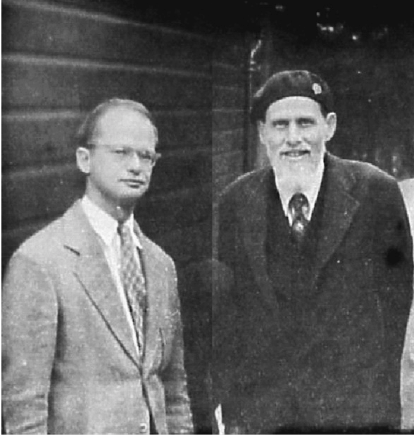

# Subsubsection 1.1

## Part 1

<!-- !!! python "Python"
    Lorem ipsum dolor sit amet, consectetur adipiscing elit. Nulla et euismod
    nulla. Curabitur feugiat, tortor non consequat finibus, justo purus auctor
    massa, nec semper lorem quam in massa.

??? tf "TensorFlow"
    test Lorem ipsum dolor sit amet, consectetur adipiscing elit. Nulla et euismod
    nulla. Curabitur feugiat, tortor non consequat finibus, justo purus auctor
    massa, nec semper lorem quam in massa. -->

Lorem ipsum dolor sit amet, consectetur adipiscing elit. Nulla et euismod
nulla. Curabitur feugiat, tortor non consequat finibus, justo purus auctor
massa, nec semper lorem quam in massa.

!!! Note "note title"

    Lorem ipsum dolor sit amet, consectetur adipiscing elit. Nulla et euismod
    nulla. Curabitur feugiat, tortor non consequat finibus, justo purus auctor
    massa, nec semper lorem quam in massa.

you can even use $\LaTeX$ command inside Material for MkDocs.

\[
\int_{0}^{+\infty} \widetilde{H}(f_{\mu}) \otimes \Omega \, \mathrm{d}\mu \equiv \mathrm{e}^{\mathrm{i}\pi}
\]

## Part 2

Lorem ipsum dolor sit amet, consectetur adipiscing elit. Nulla et euismod
nulla. Curabitur feugiat, tortor non consequat finibus, justo purus auctor
massa, nec semper lorem quam in massa.

!!! info "info title"

    Lorem ipsum dolor sit amet, consectetur adipiscing elit. Nulla et euismod
    nulla. Curabitur feugiat, tortor non consequat finibus, justo purus auctor
    massa, nec semper lorem quam in massa.

!!! info "Info"

    Note that to that for them to be displayed, images have to be given a relative path in mkodcs.

    

    Here the pictures of these two dudes is located at `./images/two_dudes.png`

!!! example "Example title"

    Lorem ipsum dolor sit amet, consectetur adipiscing elit. Nulla et euismod
    nulla. Curabitur feugiat, tortor non consequat finibus, justo purus auctor
    massa, nec semper lorem quam in massa.

!!! danger "Danger title"

    Lorem ipsum dolor sit amet, consectetur adipiscing elit. Nulla et euismod
    nulla. Curabitur feugiat, tortor non consequat finibus, justo purus auctor
    massa, nec semper lorem quam in massa.

### Subpart 2.1

Lorem ipsum dolor sit amet, consectetur adipiscing elit. Nulla et euismod
    nulla. Curabitur feugiat, tortor non consequat finibus, justo purus auctor
    massa, nec semper lorem quam in massa.

!!! question "Question title"

    Lorem ipsum dolor sit amet, consectetur adipiscing elit. Nulla et euismod
    nulla. Curabitur feugiat, tortor non consequat finibus, justo purus auctor
    massa, nec semper lorem quam in massa.

